# Beautiful Chat

A Paseo plugin that redraws the Oh My Pi (OMP) chat stream: tool calls, reasoning, prompts, approvals,
and checklists. It replaces the host rendering of OMP timeline items with typed, syntax-aware cards
that follow the active Paseo theme.

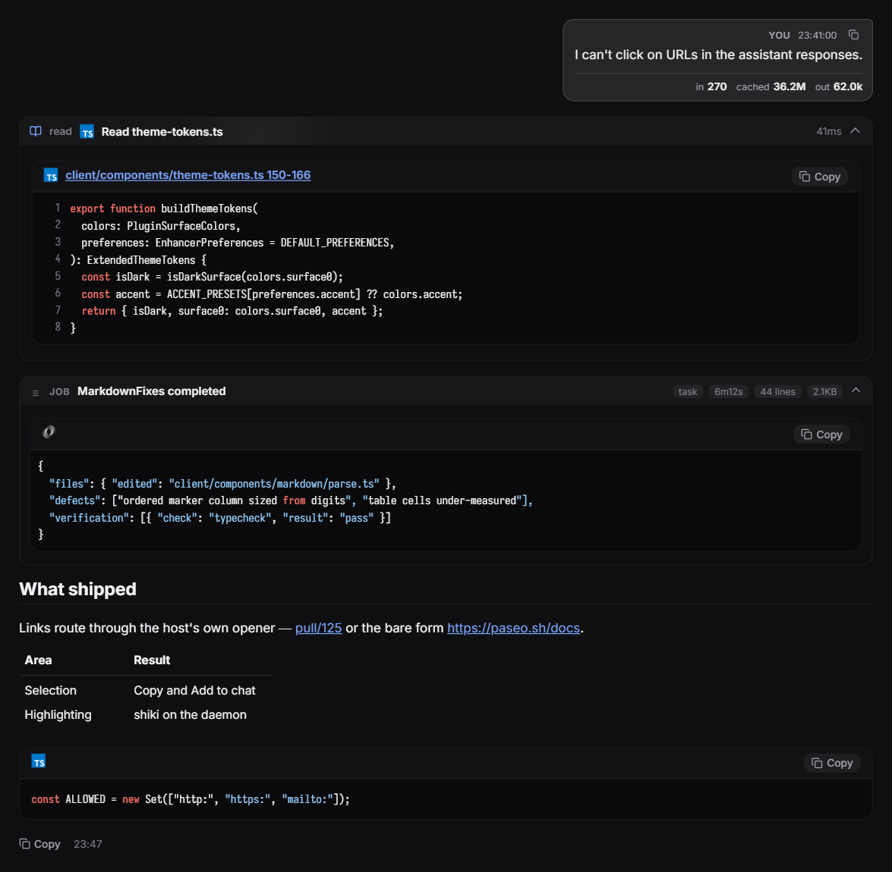

Every screenshot here is a capture of the real component, rendered by the harness in `.showcase/`.
[One whole turn, top to bottom](images/thread.png) shows the cards in the order the timeline draws
them.

## Vendored copy

This folder is a copy of [ABorakati/beautiful-chat](https://github.com/ABorakati/beautiful-chat) at `main` commit `42b61d8`, with [PR #2](https://github.com/ABorakati/beautiful-chat/pull/2) (head `ed178fc`, "Collapse tool calls and reasoning traces once they finish") merged on top. The only conflict was the settings table below, where both rows are kept.

Local changes against upstream: `paseo-plugin.json` drops the `npm ci` build step (Paseo runs build steps only for Git installs) and requires Paseo `>=0.10.0`; `@getpaseo/plugin` is pinned to 0.10.2; `package-lock.json` is replaced by `bun.lock`. PR #2's single **Collapse finished calls** switch is replaced by a choice of kinds, plus a second choice, **Collapse while running**, that keeps cards closed while their call runs so streaming output does not push the chat around (`client/collapse.ts`, with tests in `client/collapse.test.ts`). By default both collapse every kind except Reasoning. Upstream has no other tests.

Unmapped tools (`browser_*`, `grep`, `todo`, ...) name themselves in the header pill; upstream labels them `bash`, the kind their terminal frame borrows.

The prompt bubble has no token usage footer. Upstream showed the agent's latest `lastUsage` under each recent prompt, which for OMP is the running total for the whole session rather than what that prompt cost, and it disappeared once the prompt was older than five minutes.

Todo updates draw as folded one-line changes instead of a full checklist each (see [Checklist](#checklist)). The logic is in `client/todo-history.ts`, tested in `client/todo-history.test.ts`, and the header line is `client/components/todo-summary.tsx`.

Cards also read the `plain_text` details Paseo 0.11 sends for some OMP tools (`eval`, `ask`, `wait`, `think`, `yield`, the `github` device and others): a label and the result text, without the call's arguments, where Paseo 0.10 sent the raw `input` and `output`. The label becomes the card title and the text its output; an `ask` card shows the question and the answer, but not the options offered, and an `eval` card shows its output without the source. The parsing is in `client/plain-text-detail.ts`, tested in `client/plain-text-detail.test.ts`.

File icons come from [material-icon-theme](https://github.com/material-extensions/vscode-material-icon-theme), the theme VS Code and Cursor use, instead of upstream's Devicon brand marks. `client/file-icon.ts` resolves a path the way VS Code does (exact file name, then the longest extension, then the language id), so `package.json`, `tsconfig.json`, `app.test.ts` and `index.d.ts` get their own icons. The icons ship as PNG rasters in the generated `client/components/file-icon-data.ts`; the list of icons included is `ICONS` in `.showcase/tools/file-icons.ts`.

To pick up a newer upstream, diff this folder against a fresh clone and re-apply the changes above.

## Develop

Installed through `programs.paseo.plugins.beautiful-chat` (the parts/ai/homeModules/paseo.nix Home Manager module). To work on it without a switch, run `paseo-plugin-dev link beautiful-chat` from your checkout: Paseo then loads this folder, `paseo plugin reload beautiful-chat` picks up each edit, and `paseo plugin logs beautiful-chat` shows its output. `paseo-plugin-dev restore beautiful-chat` goes back to the installed build. Run `bun install` here first: a checkout has no store-built `node_modules`. See `parts/ai/AGENTS.md`.

```sh
nix shell --inputs-from "$(git rev-parse --show-toplevel)" latest#bun \
  -c sh -c 'bun install --frozen-lockfile && bun run typecheck && bun run test'
rm -rf node_modules
nix build .#paseo-plugin-beautiful-chat -L
```

The plugin's **Chat presentation** settings screen (`/settings/hosts/<server id>/plugins/beautiful-chat/chat-presentation`) holds the accent, fonts, frosted glass, prompt bubble, and collapse options.

---

## Tool calls

### Shell and Git

Terminal frame, Bash syntax, exit code, duration, and the Git brand mark. A command that prints
nothing says so rather than showing an empty panel.

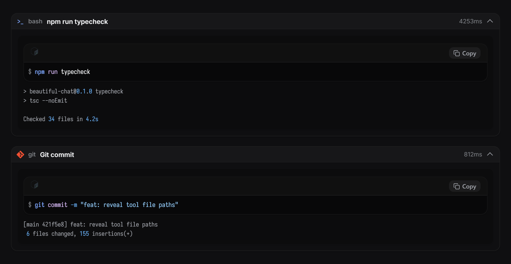

### Read

The file's own language logo, a wrapped path, line numbers, and a copy button. The path is a link:
pressing it shows the file in the machine's file manager.

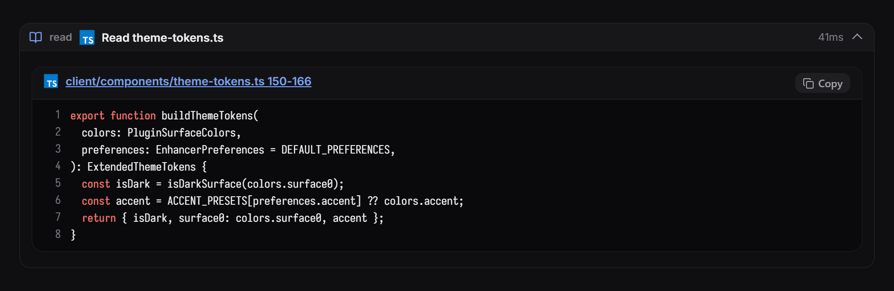

### Images

A read of a `.png` carries no bytes through the timeline, so the host draws it as an empty code
block with a language badge. This card draws the file instead: a picture mark, the path as a link,
the pixel size and file size read from the header, and an eye control that hides the thumbnail. The
bytes come from the plugin's own daemon-side RPC (`file.image`), which is the only side that can
reach the file; PNG, JPEG, GIF, WebP, AVIF, BMP, ICO and SVG are recognised, and anything past
3 MB reports its size rather than inlining a data URI.

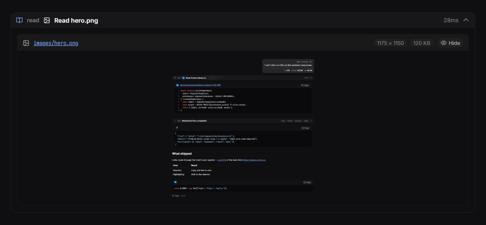

### Edit

Diff rendering where adjacent removed and added rows join into one rounded block, and only the
marker column carries the red or green.

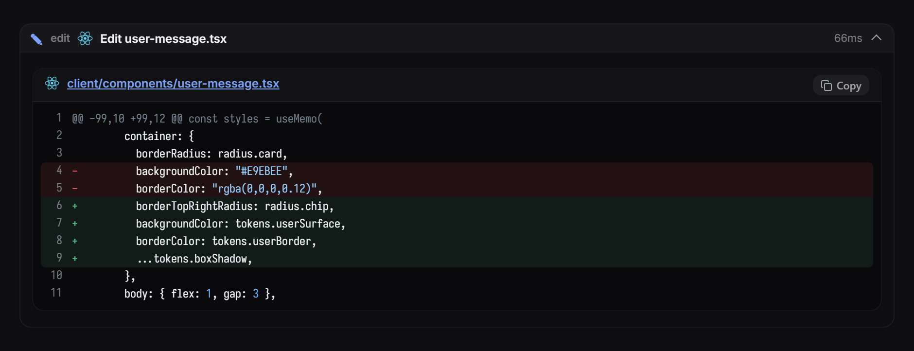

### Reasoning tool

Live thinking text, a token badge, and numbered steps.

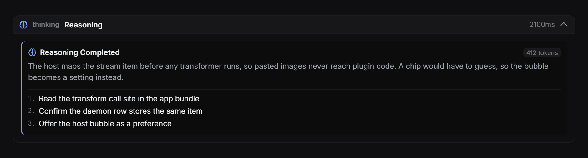

### MCP

Server badge, transport, input parameters, and the response payload, each syntax-highlighted.

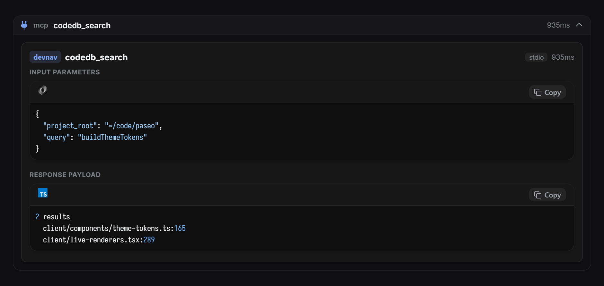

### Eval

One card per kernel cell: the source that ran, then the text it printed.

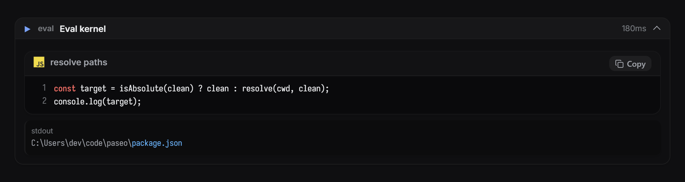

### Ask

Option cards with the recommended badge, the chosen answer marked, and a typed reply labelled as
typed rather than shown as a selection.

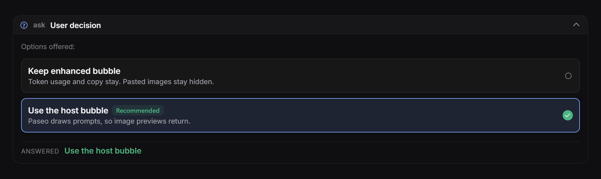

### Task

Subagent name, type, model, and the delegated instructions.

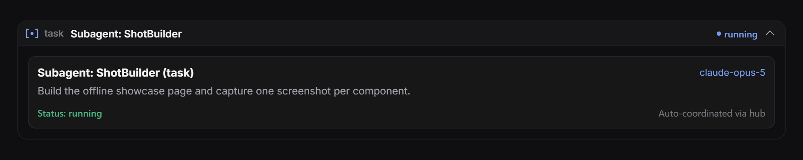

### Hub

Every `hub` op is mapped: `start`, `stop`, `restart`, `ps`, `logs`, and `describe` render the
process card with its launch line, readiness, and recent output; `send`, `wait`, `inbox`, and
`list` render the message card; `jobs` and `cancel` render the job snapshot. The cards report;
they carry no buttons, because a plugin cannot restart or cancel anything.

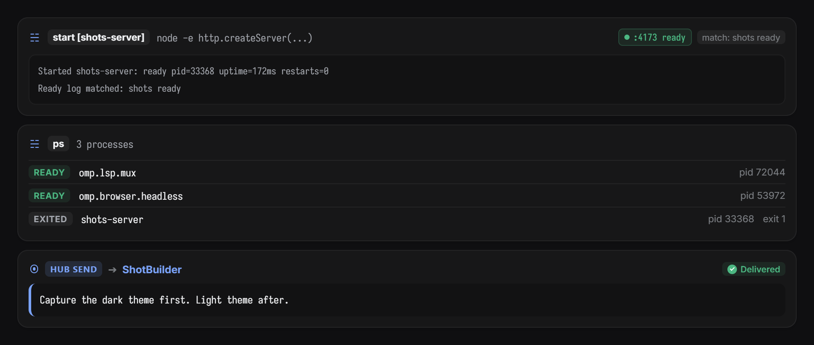

### Paseo tools

Paseo's own mark leads the card, and the created agent's provider carries its brand mark.

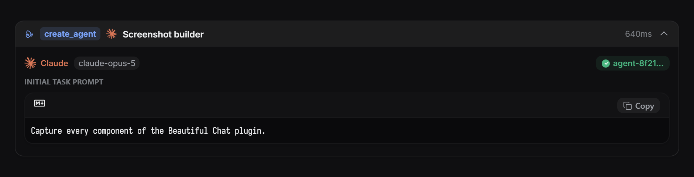

---

## Stream components

### Reasoning trace

A collapsible trace with a connected step rail, per-step duration, and a token total.

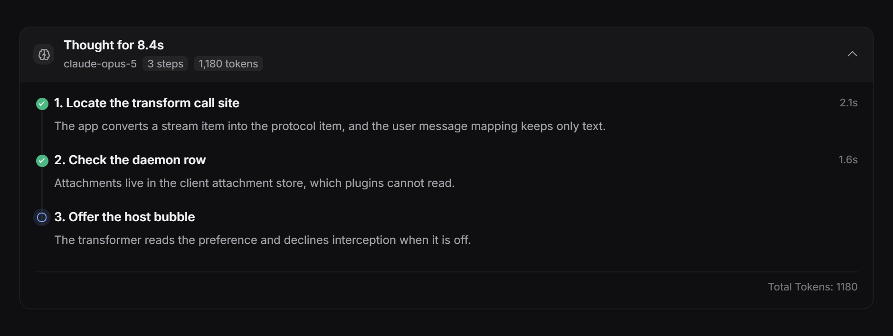

### Checklist

Phase name, per-task status, durations, and a blocked task with its reason.

In the chat, each todo update is one folded line that says what the update changed, for example `Done Wave 4` and `Started Wave 5`, with the progress count. Pressing the line opens the progress bar and the full list. Upstream drew the whole list, unfolded, for every update. The host files one row per change but hands plugins only the list, so `client/todo-history.ts` works the change out again against the list drawn before it, per agent. One call that finishes a task and starts the next makes the host file two rows with the same list, and only the first is drawn. A row with no earlier list on screen (the agent's first list, or history not loaded yet) says `Checklist` and names the running task.

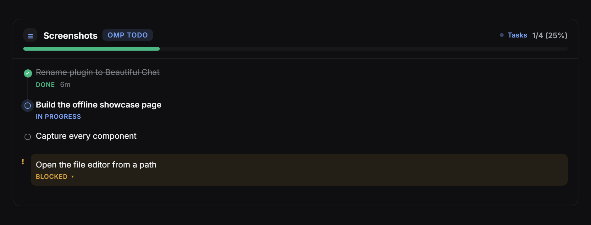

### Approval card

Risk classification, the exact command, target path, working directory, and the approve or deny
actions the host owns.

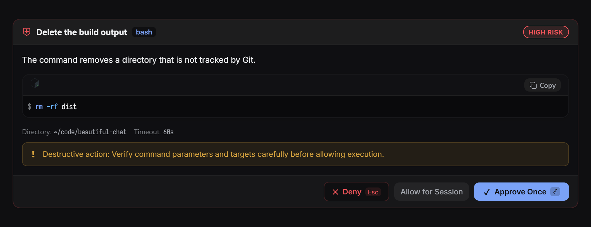

### Prompt bubble

The authored turn on a raised theme surface with a square tail and a copy button.

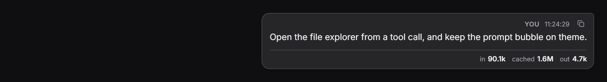

### Syntax block

Shared by every card that shows code: language detection from the path, line numbers, diff tints, material file icons, and the file-manager link.

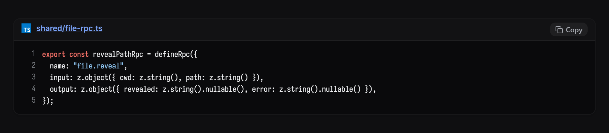

---

## Settings

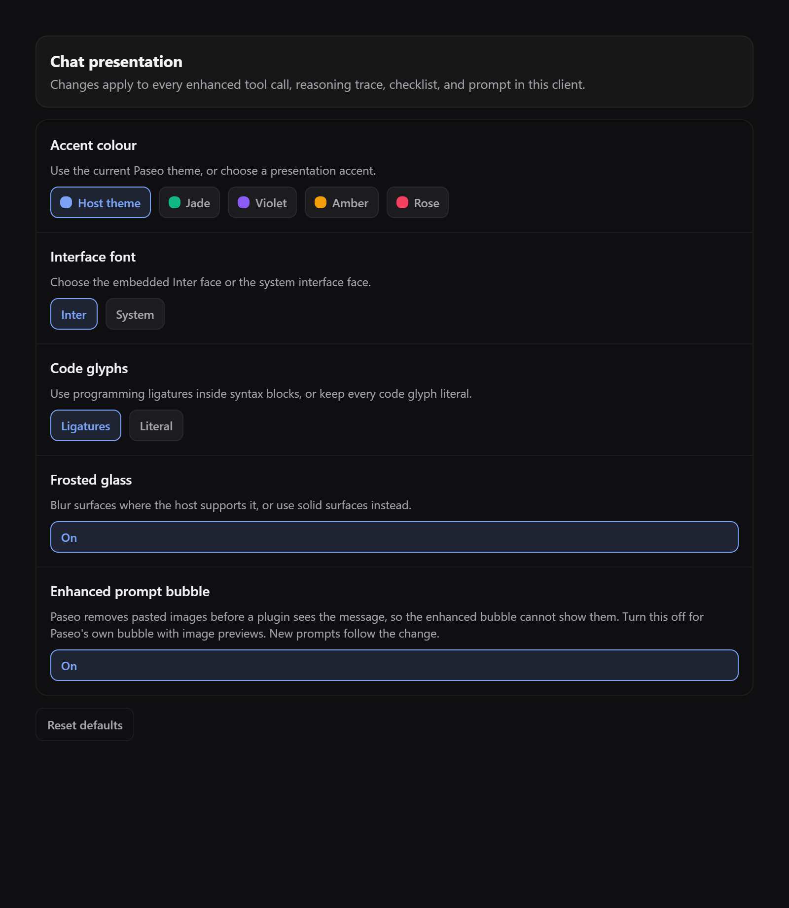

| Setting                | Effect                                                             |
| ---------------------- | ------------------------------------------------------------------ |
| Accent colour          | Follow the Paseo theme, or pick Jade, Violet, Amber, or Rose.      |
| Interface font         | Embedded Inter, or the system interface face.                      |
| Code glyphs            | Iosevka with ligatures, or literal glyphs.                         |
| Frosted glass          | Blur card surfaces, or paint them solid.                           |
| Enhanced prompt bubble | Off hands prompts back to Paseo, whose bubble shows pasted images. |
| Assistant markdown     | Off hands replies back to Paseo's own markdown renderer.           |
| Collapse while running | Picks which kinds stay closed while their call runs: Reasoning, Shell, Files, Agents, Eval, MCP, Ask, Other tools. All but Reasoning by default; unpicked kinds open while they run. |
| Collapse finished calls | Picks which kinds close once they finish, from the same kinds. All but Reasoning by default; unpicked kinds stay open. A failed call always opens. |

---

## Finding text

Paseo's own chat find (Ctrl/Cmd+F) cannot reach a prompt or reply this plugin draws (see
[limitation 14](#plugin-sdk-limitations-found-while-building-this)). The plugin therefore takes
Ctrl/Cmd+F on desktop and web and opens its own find bar over the chat. The bar searches
everything the chat has rendered, including tool cards. Enter moves to the next match, Shift+Enter
to the previous one, and Escape closes the bar.

The bar searches only messages the chat has loaded. Scroll up first to include older history.

To keep Paseo's native search, which also searches unloaded history, turn off **Assistant
markdown** and **Enhanced prompt bubble** in **Settings -> Plugins -> Beautiful Chat**. Paseo then
draws replies and prompts itself, and Ctrl/Cmd+F opens Paseo's find instead of the plugin's bar.
New messages follow the change.
Tool, reasoning, and checklist cards keep the plugin's styling, so Paseo's find still cannot reveal a
match inside one of them.

## Opening files

A file name in a read, write, edit, or code block is a link. Pressing it calls the plugin's own
daemon-side RPC (`file.reveal`), which resolves the path against the agent's working directory and
asks the platform shell to show it:

| Platform | Behaviour                                              |
| -------- | ------------------------------------------------------ |
| Windows  | `explorer.exe /select,<file>` selects the file.        |
| macOS    | `open -R <file>` selects the file in Finder.           |
| Other    | `xdg-open <directory>` opens the containing directory. |

A directory path opens that directory. A path the daemon cannot stat does nothing.

## Unmapped output

A tool the plugin has no typed card for still shows its output in the terminal frame, and a call that printed nothing says so. No card renders an empty panel. The header pill names the tool itself (`browser_wait`, `grep`, ...) rather than the `bash` kind the frame borrows.

The link cannot open Paseo's own file editor: see the first limitation below.

---

## Plugin SDK limitations found while building this

Measured against `@getpaseo/plugin` 0.8.0 and the Paseo 0.8.0 desktop build. Each entry names the
evidence and the workaround this plugin uses.

1. **No file navigation.** Timeline renderer props are exactly `{agentId, theme, host, layout,
timestamp, item}`, and plugin navigation offers only `openSettings`, `openSurface`,
   `openWorkspacePanel`, `openAgentPanel`, `openAgent`, and `openWorkspace`. The host's own file tab
   target (`{kind:"file", path}`, reachable in-app through `?open=file:<path>`) is not exposed, and
   the `paseo://` scheme only carries agent deep links. Workaround: a daemon-side RPC that reveals
   the path in the operating system's file manager.
2. **Transformers see a stripped item.** The app maps its stream item to the plugin item before any
   transformer runs, and a user message keeps only `text`, `messageId`, and `clientMessageId`. Pasted
   images never reach plugin code, and the daemon timeline row stores the same item, so a server RPC
   cannot recover them either. Workaround: the **Enhanced prompt bubble** setting returns prompts to
   the host.
3. **Interception is all or nothing.** A transformer replaces the host item completely. There is no
   way to decorate an item or keep host affordances that the plugin does not reimplement. Returning
   `undefined` is the only opt-out.
4. **Transform results are cached per item.** Changing a preference does not re-run transformers for
   items already on screen. New items follow the change; existing ones need a reload.
5. **Renderers get no workspace.** Props carry `agentId` only, so `cwd` and `workspaceId` need a
   second lookup through `useAgent`.
6. **RPC names are validated late.** The host requires `^[a-z][a-z0-9._-]*$`. A camelCase name such as `revealPath` typechecks, then fails the whole plugin at install or reload with `Invalid plugin RPC method`.
7. **The React Native runtime module is a stub in the package.** `@getpaseo/plugin/client/react-native` ships as `export {}`; the host injects the implementations. Bundling or testing plugin UI outside Paseo needs a shim, which is what `.showcase/shims` provides.
8. **The theme carries six colours.** `PluginTheme` exposes `surface0`–`surface2`, `border`, `foreground`, `foregroundMuted`, `accent`, `accentForeground`, and three status colours. Every other surface, including code backgrounds and diff tints, must be derived with alpha; that is what `client/components/theme-tokens.ts` exists for.
9. **No CSS escape hatch.** React Native styles drop unknown keys, so `backdrop-filter` is impossible through the style API. Frosted glass is a hand-injected `<style>` rule matched by a data attribute.
10. **No font registration.** Faces are embedded as data URIs in an injected `@font-face` rule, and every surface needs a wrapper that escapes the host's own font cascade.
11. **A closed module allowlist, and no SVG renderer.** Plugin client code may import only `react`, `react/jsx-runtime`, `react-native`, `@tanstack/react-query`, `zod`, `@getpaseo/plugin`, `@getpaseo/plugin/client`, `@getpaseo/plugin/client/react-native`, and `@getpaseo/plugin/client/ui`. Anything else throws `Module "x" is not available in plugin client code` when the bundle loads, so `react-native-svg` and `lucide-react-native` are out of reach. Lucide icons still work, because the host renders them: `Icon` from `@getpaseo/plugin/client/react-native` takes any Lucide name. Brand marks are not in Lucide, and React Native's `<Image>` decodes PNG, JPEG, GIF, and WebP but never SVG, so a data-URI SVG renders on web and stays blank on iOS and Android. Those marks ship as PNG rasters in `client/components/mark-bitmaps.ts`.
12. **Settings are host-scoped only.** `defineSettings` rejects any scope other than `host`, so per-workspace or per-agent presentation settings are impossible. This plugin keeps presentation preferences in client storage instead.
13. **Paseo's chat find cannot reach replaced rows.** Paseo 0.9.1 finds a match by its original message id, then waits for a row carrying that id. A transformed row always carries `<pluginId>/<itemId>` instead, so Ctrl+F on a styled prompt or reply never reveals the match. Workaround: the plugin's own find bar, described in [Finding text](#finding-text).
14. **A todo transformer sees the list, not the change.** Paseo 0.10.2 files a `todo_list` row per change (`created`, `added`, `started`, `completed`) and draws it as a one-line badge, but the plugin projection hands a transformer `{type: "todo", items}` only, with no `activity`, no row time, and no agent id. Workaround: the renderer, which does get `agentId` and `timestamp`, diffs against the list drawn before it, and the transformer drops a row whose list equals the one just before it in the same pass.

---

## Project structure

```text
beautiful-chat/
  paseo-plugin.json          # Manifest: id and Paseo requirement
  index.client.tsx           # Timeline transformers, renderers, settings screen
  index.server.ts            # Daemon-side RPCs (file.reveal)
  shared/
    contracts.ts             # Data contracts shared by client and server
    file-rpc.ts              # file.reveal contract
  client/
    file-icon.ts             # Path and language to material icon name
    live-renderers.tsx       # Timeline item to component mapping
    settings-page.tsx        # Settings screen
    preferences.ts           # Client-side presentation preferences
    todo-history.ts          # What each todo update changed, worked out per agent
    plain-text-detail.ts     # Reads Paseo 0.11 `plain_text` tool details (label + result text)
    components/              # Cards, syntax block, glyphs, motion, theme tokens
      mark-bitmaps.ts        # GENERATED PNG rasters of every brand mark
      file-icon-data.ts      # GENERATED PNG rasters and lookup tables of the file icons
      lobe-marks.ts          # Vendor SVG sources, read only by the generator
  .showcase/                 # Offline harness used to capture the screenshots
  docs/images/               # Screenshots in this README
```

## Icons and screenshots

Checks and the edit loop are under Develop above. These need `bun install` in this folder.

Rebuild the file icons after changing `ICONS` in `.showcase/tools/file-icons.ts` or bumping `material-icon-theme`:

```bash
bun run icons
```

Rebuild the screenshots after a visual change:

```bash
esbuild .showcase/showcase.tsx --bundle --outfile=.showcase/showcase.js --jsx=automatic \
  --alias:react-native=react-native-web \
  --alias:@getpaseo/plugin/client/react-native=./.showcase/shims/plugin-react-native.tsx
```

Then serve `.showcase/` and capture each `#shot-*` element.

## License

MIT
